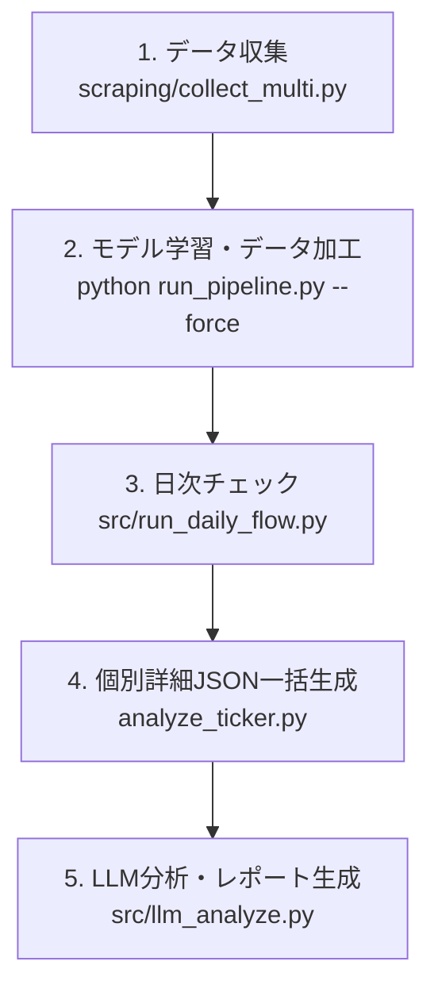

# 株価データ分析・日次フロー 実行コマンド手順書

本ドキュメントは、データスクレイピングからモデル学習、日次チェック、銘柄詳細データ生成、およびLLM分析までの一連の操作フローをまとめたマニュアルです。

---

## 1. 全体実行フロー概要

日々のデータ更新からLLMレポート出力までの標準的な流れは以下の通りです。



---

## 2. 各ステップの実行コマンド

### ステップ 1: データ収集（スクレイピング）
全対象銘柄の株価データを一括で更新・取得します。

```bash
# scraping ディレクトリに移動
cd scraping

# 複数銘柄データの一括収集実行
python collect_multi.py

# プロジェクトルートに戻る
cd ..
```

---

### ステップ 2: モデル学習およびデータ加工パイプライン
取得したデータをもとに、特徴量抽出・正解ラベル生成・モデル学習（パイプライン）を強制再実行します。

```bash
# train ディレクトリに移動
cd train

# 全フェーズを強制再実行（特徴量生成・ラベル生成・モデル更新）
python run_pipeline.py --force

# プロジェクトルートに戻る
cd ..
```

---

### ステップ 3: 日次チェック（デイリーフロー）
日次のデータ同期および保有ポジションのアラートチェック・レポート生成を行います。

```bash
# プロジェクトルートにて日次フローを実行
python src/run_daily_flow.py
```
> **生成物:** `train/reports/daily_check.md` （日次チェックレポートおよび要注意銘柄一覧）

---

### ステップ 4: 個別詳細JSONの生成
特定銘柄（またはアラート銘柄）の詳細予測データおよび特徴量重要度データ（JSON）を出力します。

#### (A) 単一銘柄の詳細JSON生成
```bash
cd train

python -m src.pipeline.analyze_ticker \
    --ticker 6857 \
    --model-dir models/task2 \
    --reliability-table reliability_table.json \
    --out-json reports/json/6857_detail.json

cd ..
```

#### (B) 複数銘柄・日次アラート対象銘柄の一括JSON生成（推奨）
要注意銘柄に対して一括で詳細JSONを作成する場合は、対象銘柄コードを指定して順次実行します。
※生成先ディレクトリは `train/reports/json` とします。

---

### ステップ 5: LLM（Gemini）による分析・レポート出力
生成された詳細JSONをもとに、LLMがリスク評価・特徴量解釈を行ったMarkdownレポートを出力します。

#### (A) 単一銘柄の分析
```bash
python ./src/llm_analyze.py single \
    --ticker 6857 \
    --json-dir ./train/reports/json \
    --output reports/6857_llm_analysis.md
```

#### (B) 日次レポート（daily_check.md）から要注意銘柄を一括自動分析
```bash
python ./src/llm_analyze.py batch \
    --daily-check-report ./train/reports/daily_check.md \
    --json-dir ./train/reports/json \
    --output-dir reports/llm_batch
```

#### (C) 銘柄コード直接指定による一括分析
```bash
python ./src/llm_analyze.py batch \
    --tickers 6857,7203,6098 \
    --json-dir ./train/reports/json \
    --output-dir reports/llm_batch
```

---

## 3. 補足・注意事項

1. **環境変数の確認**
   - LLM分析（`llm_analyze.py`）を実行する前に、`.env` ファイル等で `GEMINI_API_KEY` が設定されていることを確認してください。
2. **`--dry-run` オプション**
   - APIキーを消費せずにプロンプト構築のみを確認したい場合は、`llm_analyze.py` に `--dry-run` を付与してください。
3. **パスの基準**
   - コマンドを実行する作業ディレクトリ（`train/` または プロジェクトルート）に注意して実行してください。
