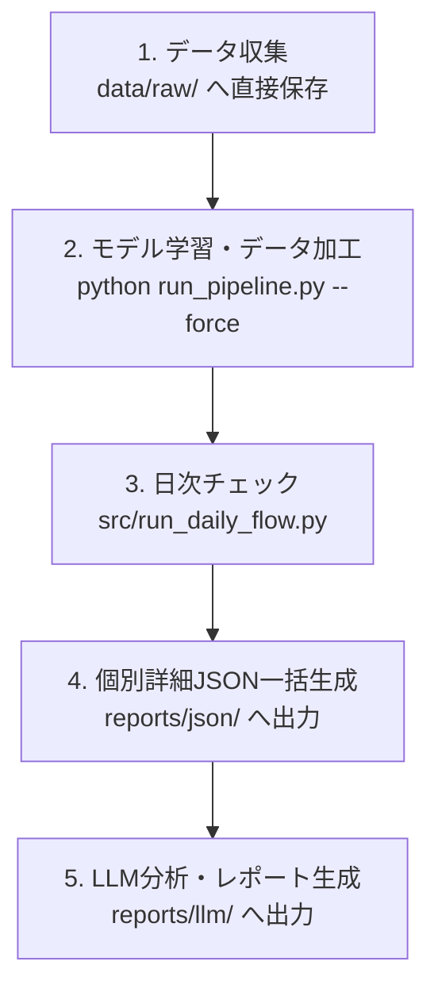

# 株価データ分析・日次フロー 実行コマンド手順書

本ドキュメントは、データスクレイピングからモデル学習、日次チェック、銘柄詳細データ生成、およびLLM分析までの一連の操作フローをまとめたマニュアルです。

---

## 1. 全体実行フロー概要

プロジェクトルート直下の統合スクリプト `run_pipeline_all.py` を用いることで、すべての工程をワンコマンドで自動実行可能です。



---

## 2. 推奨：ワンコマンド一括実行 (`run_pipeline_all.py`)

日々のデータ収集からLLMレポート生成までの標準的な日次フローを一括で実行します。
**※デフォルトの `--all` では時間の移動が大きいモデル再学習（Step 2）はスキップされます。**

```bash
# 標準日次フロー (1.収集 → 3.日次チェック → 4.JSON生成 → 5.LLM分析) を一括実行
python run_pipeline_all.py --all

# モデル再学習 (Step 2: train) も含めて全自動実行する場合
python run_pipeline_all.py --all --include-train

# モデル再学習を強制実行する場合
python run_pipeline_all.py --all --include-train --force

# 特定の銘柄 (例: 6857) の詳細JSON生成とLLM分析のみを実行
python run_pipeline_all.py --steps json,llm --ticker 6857

# LLMのAPIキー消費なしで動作確認 (ドライラン)
python run_pipeline_all.py --all --dry-run
```


---

## 3. 個別ステップごとの実行コマンド

個別に各ステップを実行したい場合のコマンドは以下の通りです。すべてプロジェクトルートから実行可能です。

### ステップ 1: データ収集（スクレイピング）
対象銘柄の株価データを `data/raw/` に直接取得・更新します。

```bash
python scraping/scraping.py --output-dir data/raw
```

---

### ステップ 2: モデル学習およびデータ加工パイプライン
`data/raw/` の生データをもとに、特徴量抽出・ラベル生成・モデル学習を実行します。

```bash
cd train
python run_pipeline.py --force
cd ..
```

---

### ステップ 3: 日次チェック（デイリーフロー）
保有ポジションのアラートチェックおよび日次レポートを出力します。

```bash
python src/run_daily_flow.py
```
> **生成物:** `reports/daily_check.md`

---

### ステップ 4: 個別詳細JSONの生成
特定銘柄（または全対象銘柄）の詳細予測データを `reports/json/` に出力します。

#### (A) 単一銘柄の詳細JSON生成
```bash
cd train
python -m src.pipeline.analyze_ticker --ticker 6857 --model-dir models/task2 --reliability-table reliability_table.json --out-json reports/json/6857_detail.json
cd ..
```

#### (B) ポジション全銘柄の一括JSON生成
```bash
cd train
python -m src.pipeline.analyze_ticker --positions-csv positions.csv --model-dir models/task2 --reliability-table reliability_table.json
cd ..
```

---

### ステップ 5: LLM（Gemini）による分析・レポート出力
生成された詳細JSONをもとに、LLMによる診断レポートを出力します。

#### (A) 単一銘柄の分析
```bash
python ./src/llm_analyze.py single --ticker 6857 --json-dir ./reports/json --output reports/llm/6857_llm_analysis.md
```

#### (B) 日次レポート（daily_check.md）から要注意銘柄を一括自動分析
```bash
python ./src/llm_analyze.py batch --daily-check-report ./reports/daily_check.md --json-dir ./reports/json --output-dir reports/llm_batch
```

---

## 4. 統一されたディレクトリ構造

```text
trading_assistant/
├── data/
│   └── raw/                   # スクレイピング生データ (CSV)
├── models/
│   └── task2/                 # 学習済みモデル・校正テーブル
├── reports/
│   ├── daily_check.md         # 日次チェックレポート
│   ├── json/                  # 銘柄詳細JSON ({ticker}_detail.json)
│   ├── llm/                   # LLM個別分析レポート ({ticker}_llm_analysis.md)
│   └── llm_batch/             # 一括LLM分析レポート
├── run_pipeline_all.py        # 統合一括実行エントリーポイント
└── src/
    ├── run_daily_flow.py      # 日次チェック用フロー
    └── llm_analyze.py         # LLM分析スクリプト
```

