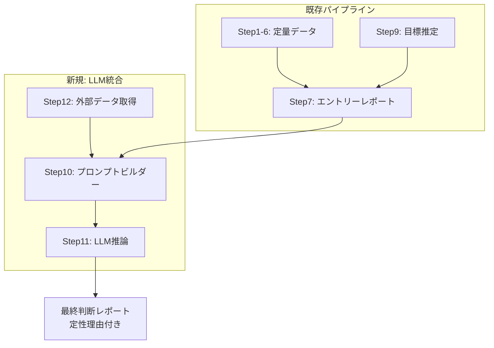

# ステップ10〜12: LLM統合による定性・定量ハイブリッド判断 設計プラン

本ドキュメントは、分析に基づき、既存のパイプライン（ステップ1〜9）にLLM（大規模言語モデル）を統合するための実装計画です。

---

## 0. 現状と課題

### 現状の限界
- ステップ1〜6: **数値データのみ**で判断（テクニカル + ML）
- ステップ7: エントリーレポートは数値の羅列に留まる
- ステップ9: MCと実績確率の乖離の**理由を説明できない**
- **市場センチメント・ニュース・マクロ環境**が一切考慮されていない

### Geminiレポートが示す方向性
```
定量（パイプライン出力）× 定性（LLMの解釈力）のハイブリッドで
「なぜこのシグナルか」「今エントリーすべきか」を人間が納得できる形で出力する
```

---

## アーキテクチャ全体像



---

## Step 10: LLMプロンプトビルダー（新規: `src/step10_prompt_builder.py`）

### 責務
パイプライン出力（数値データ）を、LLMが理解・判断可能な**構造化テキスト（プロンプト）** に変換する。

### 入力データの統合

```
【定量データ（パイプライン出力）】
  週足トレンド      : {weekly_trend}（上昇/下降）
  RSI(14)           : {rsi14}（{売られすぎ/中立/買われすぎ}）
  ATRパーセンタイル  : {atr_percentile}%（{低/中/高}ボラティリティ）
  アシストシグナル  : {assist_signal}（強気/警戒/中立）
  ML予測確率        : {y_proba:.2f}
  DD予測確率        : {drawdown_prob:.1%}
  出来高比率        : {volume_ratio:.2f}（20日平均比）

【目標推定（Step9）】
  目標       : {target_price}円（現在比 {target_pct:+.1%}）
  経験的確率 : {emp_prob_90d:.1%}（90日）
  MC確率     : {mc_prob_90d:.1%}（90日）

【銘柄プロファイル】
  コード    : {code}
  セクター  : 精密機器 / 自動車 / 電機 等
```

### 関数設計

```python
def build_llm_prompt(
    code: str,
    step5_series: pd.Series,   # step5_dataset.csv 最終行
    step4_proba: float,        # ML予測確率
    drawdown_prob: float,      # Step6 DD確率
    target_report: dict | None # Step9結果（任意）
) -> str:
    """
    全パイプライン出力を1つのプロンプトテキストに統合する。

    Returns
    -------
    マークダウン形式のプロンプト文字列
    """
```

### プロンプトテンプレート

プロンプトの構造は以下の3セクションで構成する（`report/gemini-code.md` の構造例に準拠）:

1. **指示** — 「あなたはプロのクオンツトレーダーです。..."
2. **定量データ** — パイプライン出力の構造化テキスト
3. **出力フォーマット指定** — JSON or 定型フォーマット

```python
# プロンプトテンプレート（.txtファイルとして管理してもよい）
_PROMPT_TEMPLATE = """【指示】
あなたはプロのクオンツトレーダーです。以下の定量データ・定性データを総合的に分析し、
今日「買いエントリー」をすべきか、見送るべきかを判断してください。

【銘柄情報】
コード: {code}

【定量データ（パイプライン出力）】
{quantitative_data}

【出力フォーマット】
以下のJSON形式で必ず出力してください:
{{
  "final_decision": "エントリー / 見送り",
  "confidence_score": 1-5,
  "reason_summary": "判断理由の要約（50字以内）",
  "key_risks": ["リスク1", "リスク2"],
  "key_opportunities": ["好材料1", "好材料2"]
}}
"""
```

### ファイル保存

```python
def save_prompt(prompt: str, output_dir: Path) -> Path:
    """プロンプトをテキストファイルとして保存する。"""
    path = output_dir / "llm_prompt.txt"
    path.write_text(prompt, encoding="utf-8")
    return path
```

---

## Step 11: LLM API連携モジュール（新規: `src/step11_llm_client.py`）

### 責務
Step10で生成したプロンプトをLLM APIに送信し、構造化された判断結果を取得する。

### 対応LLMプロバイダ（オプション式）

| プロバイダ | 環境変数 | モデル例 |
|-----------|---------|---------|
| OpenAI | `OPENAI_API_KEY` | gpt-4o-mini（軽量で十分） |
| Google Gemini | `GEMINI_API_KEY` | gemini-2.0-flash |
| Anthropic | `ANTHROPIC_API_KEY` | claude-3-sonnet |

### 関数設計

```python
import os
import json

def call_llm(prompt: str, provider: str = "openai") -> dict:
    """
    プロンプトをLLM APIに送信し、判断結果をdictで返す。

    Returns
    -------
    {
        "final_decision": "エントリー" or "見送り",
        "confidence_score": int,
        "reason_summary": str,
        "key_risks": list[str],
        "key_opportunities": list[str],
        "raw_response": str,
    }
    """
    api_key = os.getenv(f"{provider.upper()}_API_KEY")
    if not api_key:
        return _fallback_decision("APIキー未設定")
    # 各プロバイダのAPIを呼び出し、JSONをパース
    ...


def _fallback_decision(reason: str) -> dict:
    """API未設定時などのフォールバック判断。"""
    return {
        "final_decision": "判断不可",
        "confidence_score": 0,
        "reason_summary": f"LLM判断不可: {reason}",
        "key_risks": [],
        "key_opportunities": [],
        "raw_response": "",
    }
```

### 出力レポート（`src/step11_llm_client.py` または別関数）

```python
def build_llm_report(
    code: str,
    llm_result: dict,
    step7_decision: str,  # 既存パイプラインの判断
) -> str:
    """
    LLM判断結果と既存パイプラインの判断を比較するレポートを生成する。
    """
```

---

## Step 12: 外部データ取得パイプライン（新規: `src/step12_external_data.py`）

### 責務
ニュース・マクロ経済指標・市場センチメントを取得し、プロンプトに含める形に整形する。

### 取得データ

| データ種別 | 取得元 | 用途 |
|-----------|--------|------|
| 直近ニュース（銘柄関連） | スクレイピング or RSS | 材料・センチメント |
| 日経平均・TOPIX前日比 | Web API or CSV | 地合い判断 |
| USD/JPY 為替レート | Web API | 輸出株への影響 |
| 同業他社株価パフォーマンス | 同一resource内の他コード | セクター動向 |

### 関数設計

```python
def fetch_external_data(code: str) -> dict:
    """
    外部データを取得し、LLMプロンプト用のテキストを生成する。

    Returns
    -------
    {
        "headlines": ["..."],
        "market": {"nikkei_change": ..., "usdjpy": ...},
        "summary_text": "直近ニュース: ...\n市場環境: ...",
    }
    ```

### フォールバック動作
外部データ取得に失敗してもパイプラインは止まらない。
取得不可の場合は定量データのみでプロンプトを構成する。
```

---

## 既存ステップへのフィードバック改善

LLM判断結果を**バックテストの追加指標**として既存パイプラインにフィードバックする。

### Step 5/6 へのフィードバック

```python
# step5_assist_signal.py または main.py に追加
# LLM判断の正解率を追跡し、一定基準を下回ったら警告
def track_llm_accuracy(llm_decision: str, tb_label: int):
    """LLMの判断正解率を蓄積・表示する。"""
```

### Step 7 レポートの拡張

```
【従来】
  シグナル: 強気  |  最終判断: エントリー
  ATRパーセンタイル: 72.0%

【LLM統合後】
  シグナル: 強気  |  最終判断: エントリー
  ATRパーセンタイル: 72.0%
  ─────────────────────────
  LLM定性判断: ✅ エントリー（確信度: 4/5）
  理由: 週足上昇トレンドでの押し目買い。RSI売られすぎからの
        反転が確認され、直近に材料悪化も見られない。
```

---

## 実装ロードマップ

### フェーズ1（短期: 1〜2日）— プロンプトビルダー + フォールバック

1. `src/step10_prompt_builder.py` 作成
   - `build_llm_prompt()` — 定量データの構造化
   - `save_prompt()` — ファイル保存
2. `main.py` に `--build-prompt` フラグ追加
3. 動作確認: `python main.py --code 6981 --build-prompt`
   → `resource/6981/atr/llm_prompt.txt` が生成される

### フェーズ2（中期: 3〜5日）— LLM API連携

4. `src/step11_llm_client.py` 作成
   - `call_llm()` — OpenAI / Gemini対応
   - `_fallback_decision()` — API未設定時の安全動作
   - `build_llm_report()` — レポート生成
5. `main.py` に `--llm` / `--llm-provider` フラグ追加
6. 動作確認: `python main.py --code 6981 --llm`
   → `today_signal.txt` にLLM判断が追記される

### フェーズ3（中長期: 1〜2週間）— 外部データ + 精度評価

7. `src/step12_external_data.py` 作成
   - ニュースRSS/スクレイピング
   - マクロ指標（日経平均・為替）の自動取得
8. LLM判断の正解率トラッキング
9. step7レポートへのLLMセクション統合

---

## 実行コマンド（想定）

```bash
# フェーズ1: プロンプトファイル生成のみ
python main.py --code 6981 --build-prompt

# フェーズ2: LLM判断を追加
export OPENAI_API_KEY="sk-..."
python main.py --code 6981 --llm

# LLMプロバイダ指定
python main.py --code 6981 --llm --llm-provider gemini
export GEMINI_API_KEY="..."

# 外部データ込み
python main.py --code 6981 --llm --fetch-news

# スキャンモードでもLLM判断
python main.py --scan --llm
```

---

## 設計上の重要な決定事項

### 1. LLMは「補助判断」に留める
LLMの出力は**既存パイプラインを置き換えない**。あくまで定性理由を付与し、
人間の判断材料を増やす補助的な位置づけとする。

### 2. APIキー未設定時は安全に動作する
LLM APIが利用不可でもパイプラインは正常終了する。

### 3. プロンプトのバージョン管理
プロンプトテンプレートはコードと一緒にバージョン管理し、
変更履歴を追跡可能にする。

### 4. コスト考慮
毎日全銘柄でLLM推論を行うとAPIコストが発生する。
`--llm` は明示的オプションとし、デフォルトでは無効。
```
