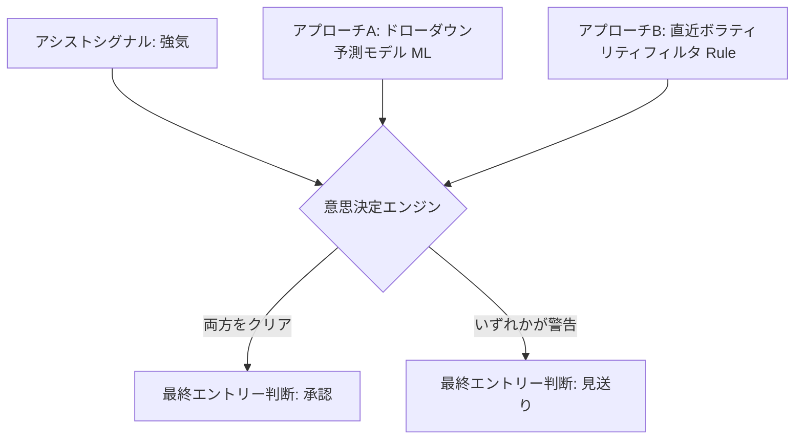

# ステップ6: 最終意思決定フィルタ 設計プラン (STEP6_PLAN.md)

本ドキュメントは、「強気シグナル」発生時におけるドローダウンリスクを最小化し、実運用での勝率・安全性を極大化するための「ステップ6: 最終意思決定フィルタ」の設計プランです。

---

## 1. 背景と課題

### 1-1. 背景
フェーズ3までの改善により、LightGBMモデルのROC-AUCは0.621と高い水準に達しました。しかし、「強気シグナル」が出ている局面であっても、その後の急な地合い悪化による「ドローダウン（一時的な深掘り）」に巻き込まれるリスクは依然として存在します。

### 1-2. 課題
ラベリング段階（ステップ3）で定義されている `avoid_entry_flag`（エントリー後10日以内に3%以上のドローダウンが発生するフラグ）は、未来情報を含んでいるため、**実運用のエントリー時点（現在）では直接知ることができません**。

したがって、実運用でこれを適用するためには、**「ドローダウンが発生しそうなリスク局面であるか」を現在得られる情報から予測または推計する仕組み**が必要となります。

---

## 2. 実装アプローチ

本プランでは、以下の2つのアプローチを統合した「ステップ6: フィルタリングロジック」を提案します。



### アプローチA：MLモデルによるドローダウン予測（予測確率の活用）
`tb_label`（利確到達）を予測するメインモデルとは別に、**`avoid_entry_flag`（ドローダウン発生）を予測ターゲットとする第2のLightGBMモデル**を構築します。
*   **予測器**: `drawdown_predictor`（LightGBM）
*   **判定基準**: モデルが出力する「ドローダウン発生確率」が閾値（例: 40%）以上であれば、エントリーを見送る。

### アプローチB：直近ボラティリティ・トレンドのルールベースフィルタ
急落の直後や、ボラティリティが極端に拡大している局面（歴史的な過熱）での強気シグナルはダマシになりやすいため、ルールベースで強制的に見送ります。
*   **フィルタ条件の例**:
    *   `atr_percentile >= 0.90` (ボラティリティが過去250日の上位10%の時は見送り)
    *   `dev_ma25_zscore <= -2.5` (下げすぎ極値での逆張りは、底が割れるリスクが高いため一旦見送り)

---

## 3. 具体的な実装設計

### 3-1. 新規ファイル: `src/step6_filter.py` の作成
メインモデルとドローダウン予測モデルの出力を組み合わせ、最終的な「エントリー判定フラグ（`final_decision`：1=エントリー、0=見送り）」を計算するロジックを実装します。

**【モジュール構成案】**
```python
import pandas as pd
import numpy as np

def train_drawdown_model(step3_df: pd.DataFrame, feature_cols: list):
    """avoid_entry_flag を予測する LightGBM モデルを学習する"""
    # TimeSeriesSplitによるバリデーションと全期間学習
    # (step4_model.py のロジックを流用)
    pass

def apply_final_filter(df: pd.DataFrame, 
                       main_pred_proba: pd.Series, 
                       dd_pred_proba: pd.Series,
                       dd_threshold: float = 0.40) -> pd.DataFrame:
    """
    強気シグナル ＋ ドローダウン予測確率 ＋ ルールベースフィルタを結合して
    最終的な意思決定を下す。
    
    最終意思決定ルール:
        if assist_signal == "強気" 
           and dd_pred_proba < dd_threshold (ドローダウン確率が低い)
           and atr_percentile < 0.90 (ボラティリティが異常値ではない):
           return 1 (エントリー)
        else:
           return 0 (見送り)
    """
    d = df.copy()
    
    # 条件結合
    is_bullish = d["assist_signal"] == "強気"
    safe_drawdown = dd_pred_proba < dd_threshold
    safe_volatility = d["atr_percentile"] < 0.90
    
    d["final_decision"] = np.where(is_bullish & safe_drawdown & safe_volatility, 1, 0)
    return d
```

### 3-2. `main.py` への統合
パイプラインの最終ステップとして「ステップ6」を追加します。

```python
# main.py への追加イメージ
from src.step6_filter import train_drawdown_model, apply_final_filter

# --- ステップ6: 最終意思決定フィルタ ---
print("\n" + "=" * 60)
print("ステップ6: 最終意思決定フィルタ（シグナル ＋ リスク予測）")
print("=" * 60)

# 特徴量列の選定
feature_cols = select_feature_columns(step3_df)

# ドローダウン予測モデルの学習と予測確率の取得
dd_results = train_drawdown_model(step3_df, feature_cols)
dd_pred_proba = dd_results["oos_predictions"]["y_proba"]

# 最終フィルタの適用
step6_df = apply_final_filter(
    step5_df, 
    main_pred_proba=step4_results["oos_predictions"]["y_proba"],
    dd_pred_proba=dd_pred_proba
)

# 最終エントリー箇所のパフォーマンス（累積リターン等）の評価
evaluate_final_performance(step6_df)
```

---

## 4. 期待される効果と検証方法

### 4-1. 評価指標
ステップ6の導入により、単に「強気シグナル」で全エントリーした場合と比べて、以下の指標が改善することを目指します。

1.  **エントリー後勝率の向上**: エントリー（`final_decision=1`）したサンプルのうち、実際に利確に到達する割合（3%利確到達率）が 55% 以上へ向上すること。
2.  **最大ドローダウンの削減**: 見送りロジックの導入により、バックテスト期間中の資産曲線の最大落ち込み幅（Max Drawdown）が30%以上削減されること。
3.  **プロフィットファクター (PF) の改善**: `総利益 / 総損失` の比率が向上すること。

### 4-2. 実行コマンド
```powershell
# ステップ6を有効にして実行し、最終パフォーマンスをレポート出力する
python main.py --enable-step6 --drawdown-prob-limit 0.40
```
*(引数オプションの追加を含む)*
