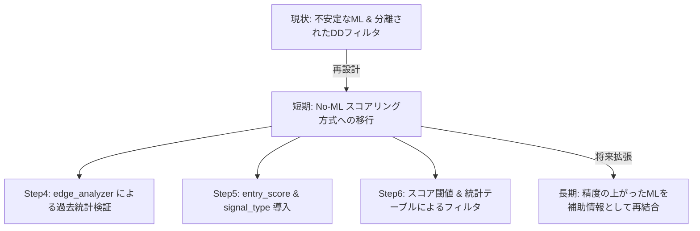

# 定量パイプライン再設計（No-ML＆スコアリング移行）実装計画書

提出された2つの改善案、
1. [trading_assistant_improvement_plan.md] (ML性能改善＆売買成績評価)
2. [trading_assistant_no_ml_strategy.md] (ML省略・ルール＆スコアリング移行)

を統合した、今後の実装計画書です。

---

## 1. アプローチ方針の整理と選択

現状、Walk-ForwardのAUCが0.5付近でランダムに近く、MLモデルを売買判断の中心に置くには根拠が弱い状態です。そのため、本計画書では**「No-ML（ルール＆スコアリング）への移行」を主軸**としつつ、将来的にMLモデルを再導入しやすくするハイブリッド構成を推奨します。

---

## 2. 実装ロードマップ

### ■ Phase 1: 評価基盤とEdge分析の導入 (Step4の刷新)
**目的**: 分類精度評価から「売買成績ベースの評価」へ移行し、過去データのEdge（優位性）を可視化する。

1. **`src/step4_edge_analyzer.py` の新規作成**
   * `step4_model.py` からモデル学習を分離（`--use-ml` 指定時のみ実行）。
   * 過去データに対する条件別（RSI帯、ATR帯、週足等）の売買成績（件数、勝率、平均リターン、PF、最大損失）を集計する `build_condition_stats()` の実装。
   * `step4_oos_predictions.csv` の代わりに、売買成績を評価する `step4_trade_metrics.csv` を生成。
2. **ラベル作成の改善 (`src/step3_labeling.py`)**
   * 利確到達かつ許容ドローダウン（DD）以内の「良質なトレード」を定義する `trade_quality_label` を追加。

### ■ Phase 2: スコアリングとシグナルの再設計 (Step5 of 刷新)
**目的**: 単一の硬いシグナルではなく、柔軟な `entry_score`（加点・減点）と複数の `signal_type` を導入する。

1. **`entry_score` ロジックの実装 (`src/step5_assist_signal.py`)**
   * 指摘メモにある簡易加減点スコアを実装。
     * 加点: 週足上昇(+2), RSI 35-50(+1), 出来高比率>=1.0(+1), MA乖離改善(+1)
     * 減点: ATR過熱(-2), RSI過熱(-1), 週足下降(-1)
2. **`signal_type` の追加**
   * シグナルを `trend_follow` (順張り), `reversal` (反転), `pullback` (低リスク押し目) に分類。
   * シグナル別の成績を集計する `step5_signal_quality.csv` の出力。

### ■ Phase 3: 意思決定フィルタとレポートの統合 (Step6・7の刷新)
**目的**: モデル予測確率の代わりに、スコア閾値と統計テーブルを用いてエントリー判断を行う。

1. **最終判断ルールの改修 (`src/step6_filter.py`)**
   * `dd_prob_limit` を見直し。ML不使用時は `entry_score` 閾値（例: 3以上）と統計テーブルによる基準（勝率55%以上等）でエントリー判断を行う。
2. **レポートの可読性向上 (`src/step7_entry_signal.py` / `src/step9_target_estimator.py`)**
   * レポートに `entry_score` とその内訳、過去類似局面での勝率/PFを表示。
   * 目標到達推定（Step9）とエントリー妥当性の記述を分離。

---

## 3. 開発タスクリスト

| フェーズ | タスク | 変更ファイル | 完了条件 |
| :--- | :--- | :--- | :--- |
| **Phase 1** | T1.1: `trade_quality_label` の追加 | `src/step3_labeling.py` | CSVに新ラベルが正しく記録される |
| | T1.2: `step4_edge_analyzer.py` の新規作成 | `src/step4_edge_analyzer.py` | 過去統計テーブル (CSV) が出力される |
| **Phase 2** | T2.1: `entry_score` と `signal_type` の実装 | `src/step5_assist_signal.py` | CSVにスコアと分類が含まれる |
| **Phase 3** | T3.1: 最終判断ルールのスコアリング移行 | `src/step6_filter.py` | スコア閾値に基づく意思決定ができる |
| | T3.2: リアルタイムレポートの出力形式更新 | `src/step7_entry_signal.py` | レポート上で加点/減点根拠が見える |
